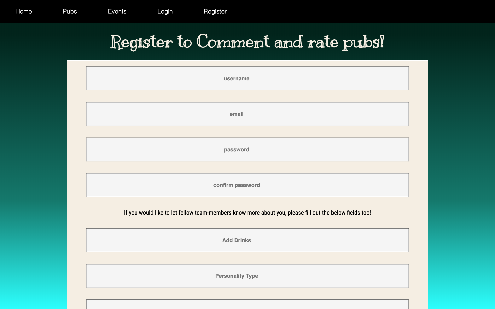
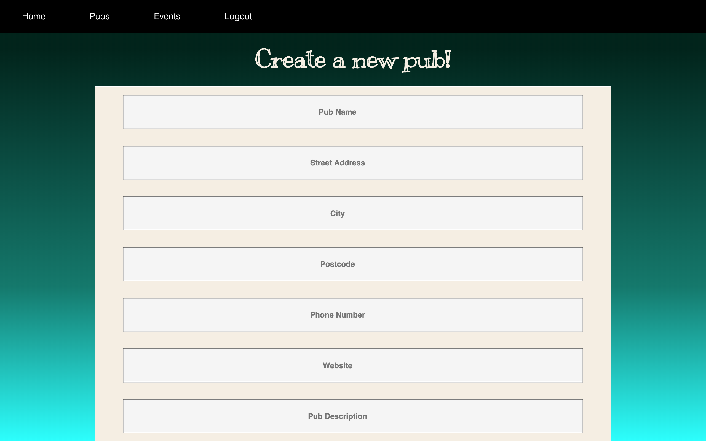

# pub-quiz-sei-project
Software Engineneering Immersive: Project 3 (Group Project)

This was a group project that we were assigned as a team of four, for the Software Engineering Immersive at General Assembly London (Week 9).

## Team members:
- Adrian Cusniriuc (https://github.com/Adriancusniriuc)
- Clare Roberts (https://github.com/flare222)
- David Campbell (https://github.com/davidcampbell-01)
- Xuan Wang (https://github.com/mmxw)

## Built With

1. HTML5
2. SCSS & Spectre
3. Javascript
   * ECMAScript6
   * React.js
   * Node.js
   * Express.js
   * axios
4. NoSQL
   * MongoDB
5. Testing
   * Manual: Insomnia
   * Automated: Mocha & Chai
5. GitHub

# User Experience

## Login & Register

The user is required to register if they intend to make any posts to any of our database models. For instance, the 'Like' and 'Add Pub' buttons on the Pub Show page will be invisible unless the user is registered and logged in. The register function also determined whether the email address is of valid format and will prompt the user in the case that they have entered and email address incorrectly. The interface also returns an error if the user has entered an email address that is associated with a pre-existing account.

#
## Profile

The user profile has several attributes that the user has the option to complete. These include: favourite drinks, personality type, bio, age, gender, quiz strengths and an optional profile image. The profile image is hosted by Cloudinary.

#
## Homepage

The homepage is the first page the user will see when they navigate to the URL. It shows minimal content, such as logo, background image and the nav bar.

#
## Posting/editing/deleting a new pub

The user can post, edit and delete a pub once they are logged in. The new pub page will show the field of required informatiomn that the user needs to input for a new pub to be added. If the user wished to edit the pub, they will be navigated to the form with the fields pre-populated with the existing information. Note that only the user who created the pub has the ability to edit or delete it.

#
## Posting/editing/deleting a new event

The event schema is nested within the pub schema. This is because each event is specific to a pub. For a user to create a new event, they must first log in and then navigate to the 'Events' or 'Pub Show' page, where they will be presented with a button that displays the form for a new event to be created. As with pub creation, each event csn only be edited or deleted by the user that created it, however any user is able to create a team within the event.

#
## Posting/editing/deleting a new team

The team schema is nested within the event schema, as each team belongs to a specific event. The team captain is shown as the user who created the team at first, however the captain is able to remove themselves and rejoin if they so wish. The 'captain' is set as the zero index of the team members array.

#
## Other users

Text Here

#
## Planning

-- BACKEND --

The backend of the app was developed first and formost using MongoDB. This was necessary in order for the functions to operate correctly and render properly on the front end. A first structure of the backend was developed and changes were made throughout the duration of the project as issues were discovered later and functionality was added.

-- FRONTEND --

The frontend was developed using React and axios for communication with the backend. We started developing the frontend on the second day of the project, in order to maxamize our time and use the time we had efficiently.

## Project Management

We structured the ten days we had as follows:
Day 1:
- Planning and assignment of tasks
Day 2:
- Began backend development
- Seed development
- Tests
- Start of frontend development
Day 3: 

## Challenges & future improvements

Text Here